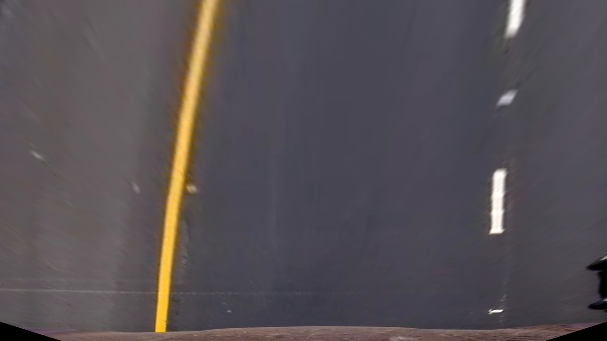

# Udacity Advanced Lane Finding Project

The goal of the project is to detect and track lane lines from center camera and calculate lines curvature and vehicle position on the road.

[//]: # (Image References)

[undist_image]: ./output_images/test_undist3_comp.jpg "Undistorted"
[pipeline_undist_image]: ./output_images/pipeline/output_02719_undist.png "Undistorted pipeline image"
[pipeline_combined_image]: ./output_images/pipeline/output_02719_combined.png "Combined Thresholded image"
[pipeline_region_image]: ./output_images/pipeline/output_02719_sel_region.png "Region selection"
[pipeline_warped_image]: ./output_images/pipeline/output_02719_comb_warped.png "Combined Warped"
[image4]: ./examples/warped_straight_lines.jpg "Warp Example"
[image5]: ./examples/color_fit_lines.jpg "Fit Visual"
[image6]: ./examples/example_output.jpg "Output"
[video1]: ./project_video.mp4 "Video"
[video_result]: https://youtu.be/DnsH4Gcqo-c "Result Video"
[video_sample]: ./output_images/result_video/output_sample.gif "Sample Video"

## Run

The following command process first 2 seconds(`--t_start 0.0 --t_end 2.0`) of the `project_video.mp4` file using camera matrix and distortion coefficients from `dist_pickle.p` that was calculated and saved previously (see below for details). Video output stored in `output.mp4` file. Verbose flag `--verbose` activates sampling of randomly selected images from the processing pipeline and store images on each step in `output_images` folder.
```
python find_lines.py --video project_video.mp4 --output_video output.mp4 --mtx_dist dist_pickle.p --t_start 0.0 --t_end 2.0 --verbose
```
You should get the result similar to this:
![Example of generated video ][video_sample]

To calculate camera matrix and distortion coefficient for your camera you can use command:
```
python camera_calibration.py --images_pattern 'camera_cal/calibration*.jpg' --save_file dist_pickle.p --nx 9 --ny 6 --verbose
```

## Detailed steps

The detailed steps of this project are the following:

* Compute the camera calibration matrix and distortion coefficients given a set of chessboard images.
* Apply a distortion correction to raw images.
* Use color transforms, gradients, etc., to create a thresholded binary image.
* Apply a perspective transform to rectify binary image ("birds-eye view").
* Detect lane pixels and fit to find the lane boundary.
* Determine the curvature of the lane and vehicle position with respect to center.
* Warp the detected lane boundaries back onto the original image.
* Output visual display of the lane boundaries and numerical estimation of lane curvature and vehicle position.


## Camera matrix and distortion coefficients

Camera calibration based on a set chess board images from [camera_cal](./camera_cal) and uses OpenCV functions `cv2.findChessboardCorners(gray, (nx,ny), None)` and `cv2.calibrateCamera(objpoints, imgpoints, img_size, None, None)`. Implementation of camera calibration in `calibration.py`.

Undistorted (corrected) images could be obtained by `cv2.undistort(image, mtx, dist, None, mtx)`. Sample result undistorted image:

![a][undist_image]

## Pipeline (single images)

### Step 1: Distortion correction
Sample of distortion correction from the pipeline:

![Undistorted pipeline sample][pipeline_undist_image]

Implementation in `process_image()` function of `LineFinder` class:
```
# Undistort
undist = cv2.undistort(image, self.mtx, self.dist, None, self.mtx)
```

### Step 2: Use color transforms, gradients and magnitude thresholds to identify pixels of interest

For the given `project_video.mp4` problem I've found that combination of gradient in x axis together with direction and magnitude thresholds worked the best. Also I've applied a thresholding to Red and Saturation color channels and combined them all in one combined threshold image.

Below is the implementation of all thresholds and their combination:
```
def apply_all_thresholds(img):
  ksize = 31
  thresh_sobel = (50, 150)
  thresh_mag = (50, 255)
  thresh_dir = (0.75, 1.15)

  # Gradient, Magnitude, Direction Thresholds
  gradx = sobel_threshold(img, orient='x', sobel_kernel=ksize, thresh=thresh_sobel)
  mag_bin = mag_threshold(img, sobel_kernel=ksize, mag_thresh=thresh_mag)
  dir_bin = dir_threshold(img, sobel_kernel=ksize, thresh=thresh_dir)

  # Combine Thresholds 1
  comb_bin = np.zeros_like(gradx)
  comb_bin[(gradx == 1) | ((dir_bin == 1) & (mag_bin == 1))] = 1

  # Color Threshold S-channel
  thresh_s = (170, 255)

  hls = cv2.cvtColor(img, cv2.COLOR_RGB2HLS)
  img_color = hls[:,:,2]

  color_bin = np.zeros_like(img_color)
  color_bin[(img_color > thresh_s[0]) & (img_color <= thresh_s[1])] = 1

  # Color Threshold R-channel
  thresh_r = (200, 255)
  r_img = img[:,:,0]

  r_bin = np.zeros_like(r_img)
  r_bin[(r_img > thresh_r[0]) & (r_img <= thresh_r[1])] = 1

  # Combined Gradient/Mag + Color S + Color R
  combined = np.zeros_like(comb_bin)
  combined[(comb_bin == 1) | (color_bin == 1) | (r_bin == 1)] = 1

  return combined
```

Sample from pipeline:

![Combined Thresholded Image][pipeline_combined_image]


### Step 3: Perspective transform ("birds-eye view")

In order to determine curvature we need to look at the road from the "birds-eye" perspective.

Processing in `process_image()`:
```
# Transform to 'birds view'
combined_warped = self.warpTransform(combined)
```

Transform matrices are calculated only once per video because they are the same for our case:
```
def calculateTransformMatrices(self):
  if (self.M is None) or (self.Minv is None):
      self.M = cv2.getPerspectiveTransform(np.float32(self.region_vertices), np.float32(self.dest_vertices))
      self.Minv = cv2.getPerspectiveTransform(np.float32(self.dest_vertices), np.float32(self.region_vertices))

def warpTransform(self, img):
  return cv2.warpPerspective(img, self.M, (self.w, self.h), flags=cv2.INTER_LINEAR)
```

Here is the selected points for transformation which was manually selected (blue lines) for this specific video (e.g. camera setup).

![Region selected][pipeline_region_image]

Result of "birds-view" transformation:

![Combine Warped][pipeline_warped_image]

Warped original image:



Selected params is the best guess that works 'almost' for all video sequence but they are not ideal because there bumps and hills on the road that change the perspective and in such situations lines deviate from the parallel.

![alt text][image4]

####4. Describe how (and identify where in your code) you identified lane-line pixels and fit their positions with a polynomial?

Then I did some other stuff and fit my lane lines with a 2nd order polynomial kinda like this:

![alt text][image5]

####5. Describe how (and identify where in your code) you calculated the radius of curvature of the lane and the position of the vehicle with respect to center.

I did this in lines # through # in my code in `my_other_file.py`

####6. Provide an example image of your result plotted back down onto the road such that the lane area is identified clearly.

I implemented this step in lines # through # in my code in `yet_another_file.py` in the function `map_lane()`.  Here is an example of my result on a test image:

![alt text][image6]

---

###Pipeline (video)

####1. Provide a link to your final video output.  Your pipeline should perform reasonably well on the entire project video (wobbly lines are ok but no catastrophic failures that would cause the car to drive off the road!).

Here's a [link to my video result](./project_video.mp4)

---

###Discussion

####1. Briefly discuss any problems / issues you faced in your implementation of this project.  Where will your pipeline likely fail?  What could you do to make it more robust?

Here I'll talk about the approach I took, what techniques I used, what worked and why, where the pipeline might fail and how I might improve it if I were going to pursue this project further.  
